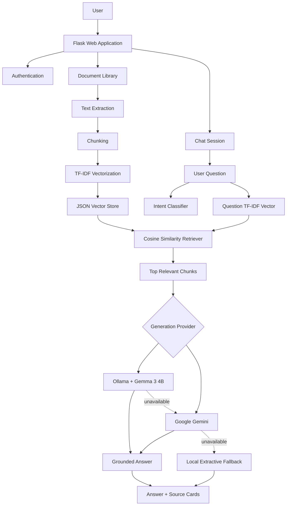

# Scholar — RAG From Scratch

Scholar is a **document question-answering system** built in Python and Flask that demonstrates a complete Retrieval-Augmented Generation (RAG) workflow from scratch.

The application lets users upload documents, retrieve the most relevant chunks using **TF-IDF + cosine similarity**, and generate grounded answers using a local LLM through **Ollama + Gemma 3 4B**. Google Gemini is kept as an optional cloud provider/fallback.

The current UI is a three-panel Scholar-style interface with:

- Document library and document scope on the left
- Chat conversation in the center
- Retrieved source chunks and similarity scores on the right

---

## Current Working Output

The current project has been tested with the local model:

```text
Ollama · Gemma 3 4B
```

Example questions and observed answers:

### Example 1

**Question**

```text
What is an embedding vector?
```

**Answer**

```text
An embedding vector is a numeric representation of text meaning.
```

### Example 2

**Question**

```text
What is cosine similarity?
```

**Answer**

```text
Cosine similarity measures how similar two vectors are by comparing the angle between them.
```

### Example 3

**Question**

```text
What can a normal user do?
```

**Answer**

```text
A normal user can select documents, ask questions, rebuild the vector store, download chats, and clear chats.
```

### Example 4

**Question**

```text
What happens if both LLMs are unavailable?
```

**Answer**

```text
The project uses a local extractive fallback that selects relevant text from retrieved chunks.
```

### Example 5

**Question**

```text
Why is chunk overlap useful?
```

**Answer**

```text
Chunk overlap helps preserve context that may otherwise be split between two chunks.
```

The interface also displays:

```text
Intent
RAG Confidence
Number of Sources
Actual Generation Model
```

For example:

```text
Definition · RAG: High · 1 Source · Ollama · Gemma 3 4B
```

---

# Project Objective

The objective of this project is to understand and implement the important components of a RAG application directly instead of hiding the complete workflow behind a large RAG framework.

The project implements:

```text
Document Upload
      ↓
Text Extraction
      ↓
Chunking
      ↓
TF-IDF Vectorization
      ↓
Local JSON Vector Store
      ↓
User Question
      ↓
Intent Classification
      ↓
Question Vectorization
      ↓
Cosine Similarity Retrieval
      ↓
Top Relevant Chunks
      ↓
Ollama / Gemma 3 4B
      ↓
Grounded Answer
      ↓
Sources + Citations
```

---

# Main Features

## 1. Document Processing

Supported files:

```text
PDF
DOCX
TXT
```

The system can:

- Upload supported files
- Extract text
- Process PDF files page by page
- Divide text into chunks
- Use overlapping chunks
- Store filename and chunk metadata
- Preserve PDF page number when available
- Rebuild the vector store after document changes

---

## 2. RAG Retrieval

The retrieval pipeline uses:

```text
TF-IDF
+
Cosine Similarity
```

When a question is submitted:

1. The question is converted into a TF-IDF vector.
2. The system compares it with stored chunk vectors.
3. Cosine similarity scores are calculated.
4. The highest-scoring chunks are selected.
5. Only those retrieved chunks are passed to the answer generator.

This keeps the answer grounded in uploaded documents.

---

## 3. Source Panel

The right-side Sources panel shows the retrieved evidence used for the answer.

Example:

```text
[1]                     score 0.6229

rag_120_qa_test.txt

Chunk 5

Relevant source text appears here...
```

For PDF files, the project can also show:

```text
policy.pdf
Page 4 · Chunk 7
```

This makes it easier to verify where an answer came from.

---

## 4. RAG Confidence

The application converts the highest retrieval score into a readable RAG confidence label.

Current thresholds:

```text
High      >= 0.30
Medium    >= 0.10
Low       > 0
No Match  no usable supporting context
```

Example:

```text
RAG: High
```

The RAG confidence represents **retrieval confidence**, not guaranteed factual certainty.

---

# Local LLM with Ollama

The default generation model is:

```text
Gemma 3 4B
```

running locally through:

```text
Ollama
```

The UI displays:

```text
Ollama · Gemma 3 4B
```

This provides a free local LLM option and avoids depending on daily cloud API quotas for normal use.

---

# LLM Provider Flow

The project supports the following generation flow:

```text
Selected Provider
       ↓

Ollama + Gemma 3 4B
       ↓
if unavailable
       ↓
Google Gemini
       ↓
if unavailable
       ↓
Local Extractive Fallback
```

The application stores the generator that **actually produced the answer**.

Possible badges include:

```text
Ollama · Gemma 3 4B
```

```text
Gemini · Gemini 3.5 Flash
```

```text
Local Extractive Fallback
```

```text
No LLM · No Context
```

If a provider different from the selected provider had to answer, the interface can also indicate a fallback.

---

# No-Context Protection

The system is designed to avoid answering unsupported questions.

If useful document context is not found, the expected response is:

```text
I could not find enough relevant information in the uploaded documents.
```

In this situation:

```text
RAG: No Match
0 Sources
No LLM · No Context
```

No unnecessary LLM request needs to be made when no relevant source context exists.

---

# Machine Learning Intent Classification

The project also contains an ML-based intent classifier.

Technology:

```text
TF-IDF
+
Logistic Regression
```

Intent categories include:

```text
definition
process
file_support
component
comparison
troubleshooting
general
```

The predicted intent is displayed with each answer.

Example:

```text
Definition
```

The classifier also supports:

- Intent confidence
- Low-confidence detection
- Intent-based Top-K retrieval adjustment
- Admin-controlled model retraining

---

# Authentication and User Roles

The application includes login/logout and role-based access.

## Admin

An admin can:

- Login
- Upload documents
- Delete documents
- Select documents
- Search all documents
- Ask questions
- Create new chat sessions
- Rebuild the vector store
- Download chat history
- Clear chat history
- Create users
- Delete users
- Train/retrain the ML intent classifier

## Normal User

A normal user can:

- Login
- Select documents
- Search documents
- Ask questions
- Create chat sessions
- Rebuild the vector store
- Download chat history
- Clear chat history

A normal user cannot:

- Upload documents
- Delete documents
- Manage users
- Train the ML model

---

# User Management

Admin users have access to a User Management section.

It supports:

```text
Create User
Delete User
Assign Admin/User Role
Hashed Password Storage
```

The currently logged-in admin cannot delete their own account while logged in.

---

# Chat Sessions

Scholar supports multiple chat sessions.

Features include:

- New chat
- Chat session switching
- Chat title generated from the first question
- Stored message history
- Latest sources for a selected answer
- Download active chat
- Clear active chat

---

# Document Scope

Users can ask questions against:

```text
All Documents
```

or scope retrieval to a specific document.

The UI displays the active scope, for example:

```text
1 DOC SCOPED
```

This is useful when the user wants answers only from one selected document.

---

# Vector Store

The project uses a local JSON vector store instead of an external vector database.

Example stored chunk metadata:

```json
{
    "filename": "policy.pdf",
    "page_number": 4,
    "chunk_id": 7,
    "page_chunk_id": 2,
    "text": "Example document text..."
}
```

The vector store also contains:

- Vocabulary
- IDF values
- Chunk vectors
- Document metadata

---

# Rebuild Vector Store

The application contains a:

```text
Rebuild Vector Store
```

action.

This recreates the vector store from the documents currently available in the project.

Rebuild is useful after:

- Adding documents
- Removing documents
- Modifying documents
- Changing chunking/indexing logic

Both logged-in admins and normal users can run the rebuild action in the current version.

---

# Technology Stack

| Component | Technology |
|---|---|
| Programming Language | Python 3.10+ |
| Web Framework | Flask |
| Frontend | HTML, CSS, JavaScript |
| PDF Extraction | pypdf |
| DOCX Extraction | python-docx |
| Vectorization | TF-IDF |
| Similarity | Cosine Similarity |
| Vector Store | Local JSON |
| Intent ML | scikit-learn Logistic Regression |
| Local LLM | Ollama + Gemma 3 4B |
| Optional Cloud LLM | Google Gemini |
| Authentication | Flask Session |
| Password Security | Werkzeug Password Hashing |
| Environment Config | python-dotenv |

---

# Architecture



---

# Project Structure

```text
RAG-From-Scratch-Chat-with-Your-Documents-Citations/
│
├── web_app.py
├── generator.py
├── ingest.py
├── extract_text.py
├── chunker.py
├── embeddings.py
├── retriever.py
├── intent_classifier.py
├── train_intent_model.py
│
├── requirements.txt
├── README.md
├── .env
├── .env.example
├── .gitignore
├── users.json
│
├── documents/
│   ├── rag.txt
│   └── rag_120_qa_test.txt
│
├── vector_store/
│   └── store.json
│
├── ml_model/
│   ├── intent_model.joblib
│   └── metrics.json
│
├── templates/
│   ├── login.html
│   └── dashboard.html
│
└── static/
    └── style.css
```

Generated/local folders can be excluded from Git depending on submission requirements.

---

# Installation

## 1. Clone Repository

```bash
git clone https://github.com/rajravinesh48/RAG-From-Scratch-Chat-with-Your-Documents-Citations-.git
```

Then:

```bash
cd RAG-From-Scratch-Chat-with-Your-Documents-Citations
```

---

## 2. Create Virtual Environment

### Windows

```powershell
python -m venv venv
venv\Scripts\activate
```

### macOS/Linux

```bash
python3 -m venv venv
source venv/bin/activate
```

---

## 3. Install Python Packages

```bash
pip install -r requirements.txt
```

Typical dependencies:

```text
Flask
python-dotenv
pypdf
python-docx
numpy
scikit-learn
joblib
openai
Werkzeug
```

---

# Install Ollama

Install Ollama on the computer that will run the project.

After installation, verify:

```powershell
ollama --version
```

Download the local model:

```powershell
ollama pull gemma3:4b
```

Check installed models:

```powershell
ollama list
```

Test the model:

```powershell
ollama run gemma3:4b
```

Exit:

```text
/bye
```

The local Ollama API is normally:

```text
http://localhost:11434
```

---

# Environment Configuration

Create a `.env` file in the project root.

Example:

```env
# Flask
FLASK_SECRET_KEY=replace_with_your_secret_key

# Default provider
LLM_PROVIDER=ollama

# Local Ollama
OLLAMA_ENABLED=true
OLLAMA_BASE_URL=http://localhost:11434
OLLAMA_MODEL=gemma3:4b
OLLAMA_TIMEOUT=120

# Optional Gemini
GEMINI_ENABLED=false
GEMINI_API_KEY=
GEMINI_MODEL=gemini-3.5-flash
GEMINI_BASE_URL=https://generativelanguage.googleapis.com/v1beta/openai/
GEMINI_TIMEOUT=45
```

If Gemini is required:

```env
GEMINI_ENABLED=true
```

and provide your own API key.

Never commit a real API key or `.env` file to a public repository.

---

# Build the Vector Store

Run:

```powershell
python ingest.py
```

Typical output:

```text
Reading file: rag.txt
Chunks created: ...

Reading file: rag_120_qa_test.txt
Chunks created: ...

Vector store created successfully.
Total chunks saved: ...
```

---

# Run the Web Application

Start Flask:

```powershell
python web_app.py
```

Open:

```text
http://127.0.0.1:5000
```

---

# Demo Accounts

When `users.json` does not exist, the current development version can create default demo users.

```text
Admin
Username: admin
Password: admin123
```

```text
User
Username: user
Password: user123
```

These accounts are intended only for development/demo purposes.

---

# Recommended Test Document

The project can be tested with:

```text
rag_120_qa_test.txt
```

This document contains many direct question-answer facts about:

- RAG
- TF-IDF
- Chunking
- Cosine similarity
- Vector store
- Ollama
- Gemma
- Gemini
- User roles
- Chat
- Citations
- ML intent classification

For predictable testing:

1. Upload the test file.
2. Rebuild the vector store.
3. Select only `rag_120_qa_test.txt`.
4. Ask the test questions.

---

# Recommended Test Questions

```text
What is an embedding vector?
```

```text
What is cosine similarity?
```

```text
What can a normal user do?
```

```text
What happens if both LLMs are unavailable?
```

```text
Why is chunk overlap useful?
```

```text
What is RAG?
```

```text
How are relevant chunks retrieved?
```

```text
What is TF-IDF?
```

```text
Which file types are supported?
```

```text
What is Ollama?
```

```text
Which local language model is used?
```

```text
What is intent classification?
```

---

# Negative Testing

Ask a question that is not covered by the selected document.

Example:

```text
What is the weather today?
```

Expected behavior:

```text
I could not find enough relevant information in the uploaded documents.
```

The UI should indicate:

```text
RAG: No Match
0 Sources
No LLM · No Context
```

---

# Example Output

A normal successful result can look like:

```text
YOU

What is cosine similarity?


ASSISTANT

Definition
RAG: High
1 Source
Ollama · Gemma 3 4B

Cosine similarity measures how similar two vectors are
by comparing the angle between them.
```

The Sources panel displays the supporting retrieved chunk and similarity score.

---

# Chat Download

The downloaded chat history can include:

```text
Question
Answer
Timestamp
Intent
Intent Confidence
RAG Confidence
Sources
Selected Document
Selected Model
Actual Generation Model
Fallback Status
```

Example:

```text
Generated By: Ollama · Gemma 3 4B
```

If another provider was required:

```text
Generation Fallback: Yes
```

---

# Why This Is RAG From Scratch

The project does not rely on LangChain or LlamaIndex to implement the central retrieval pipeline.

The following logic is implemented directly:

```text
Extract Text
    ↓
Create Chunks
    ↓
Create TF-IDF Vectors
    ↓
Store Vectors + Metadata
    ↓
Vectorize Question
    ↓
Calculate Cosine Similarity
    ↓
Rank Chunks
    ↓
Select Top Chunks
    ↓
Construct LLM Context
    ↓
Generate Answer
    ↓
Show Supporting Sources
```

The external/local LLM is used only after retrieval.

---

# Current Strengths

- Complete end-to-end RAG workflow
- Core retrieval logic implemented directly
- Free local LLM support
- Cloud LLM optional rather than mandatory
- Grounded source display
- RAG confidence
- Page-aware PDF chunks
- ML intent classification
- Role-based authentication
- User management
- Multiple chat sessions
- Document scoping
- Vector store rebuild
- Chat download
- Clear no-context behavior
- Clean three-panel UI

---

# Current Limitations

This is an academic/student project, not a production-scale RAG platform.

Current limitations include:

- TF-IDF is mainly lexical rather than deep-semantic retrieval
- JSON is not suitable for a very large vector database
- Local LLM speed depends on system hardware
- Flask session storage is not ideal for large persistent chat history
- TXT and DOCX do not provide reliable physical page numbers
- Intent-classification accuracy depends on the training examples
- Retrieval thresholds may require tuning for different document collections
- Authentication is designed primarily for project demonstration

---

# Future Improvements

Possible future enhancements include:

- Dense embedding models
- FAISS
- ChromaDB
- Hybrid retrieval
- Reranking
- Multiple-document multi-select
- Streaming LLM responses
- Clickable inline citations
- PDF source highlighting
- Automatic retrieval evaluation
- Retrieval accuracy dashboard
- SQLite/PostgreSQL chat persistence
- Production authentication
- CSRF protection
- Docker deployment

These improvements are optional and are not necessary to demonstrate the current project.

---

# Evaluation Ideas

A labelled evaluation file can contain:

```text
Question
Expected Source
Expected Answer
```

Possible metrics:

| Metric | Meaning |
|---|---|
| Top-1 Retrieval Accuracy | Correct source ranked first |
| Top-3 Retrieval Accuracy | Correct source appears in top three |
| No-Match Accuracy | Unrelated questions correctly rejected |
| Intent Accuracy | Correct intent classification |
| Citation Accuracy | Correct source metadata displayed |

---

# Security Before GitHub Submission

Before pushing the final project:

- Do not commit `.env`
- Do not commit API keys
- Do not upload private/company documents
- Do not upload real user passwords
- Use hashed passwords
- Use only sample documents
- Generate a non-default Flask secret
- Verify `.gitignore`

Generate a Flask secret with:

```bash
python -c "import secrets; print(secrets.token_hex(32))"
```

---

# Recommended `.gitignore`

```gitignore
.env

venv/
.venv/

__pycache__/
*.pyc
*.pyo

.vscode/
.idea/

.DS_Store
Thumbs.db

vector_store/
ml_model/
```

If documents should not be published:

```gitignore
documents/
```

Otherwise keep only safe sample/test documents.

---

# Final Submission Checklist

- [ ] Flask application starts successfully
- [ ] Ollama is installed
- [ ] `gemma3:4b` is installed
- [ ] Admin login works
- [ ] User login works
- [ ] User management works
- [ ] PDF upload works
- [ ] DOCX upload works
- [ ] TXT upload works
- [ ] Document selection works
- [ ] Vector store rebuild works
- [ ] RAG retrieval works
- [ ] Ollama answer generation works
- [ ] Sources are displayed
- [ ] Similarity score is displayed
- [ ] PDF page metadata works
- [ ] Intent classification works
- [ ] No-match behavior works
- [ ] Multiple chats work
- [ ] Chat download works
- [ ] `.env` is ignored
- [ ] No API keys are committed
- [ ] README is included
- [ ] Project screenshot is included

---

# Academic Explanation

A short explanation for a viva/demo:

> Scholar is a Retrieval-Augmented Generation application implemented from scratch in Python. Documents are extracted and split into overlapping chunks. TF-IDF converts the chunks and user question into vectors, and cosine similarity retrieves the most relevant chunks. Only these retrieved chunks are provided to Gemma 3 4B running locally through Ollama. The system then generates a grounded answer and displays the supporting source chunks and similarity scores. The project also includes ML-based intent classification, role-based authentication, user management, multiple chat sessions, PDF page metadata, and optional Gemini fallback.

---

# Repository

```text
https://github.com/rajravinesh48/RAG-From-Scratch-Chat-with-Your-Documents-Citations-.git
```

---

# Author

**RAG From Scratch — Student Project**

Application name:

```text
Scholar
```

---

## Final Note

The main idea behind Scholar is simple:

> **Retrieve relevant evidence first, generate the answer second, and show the source used to support the response.**
